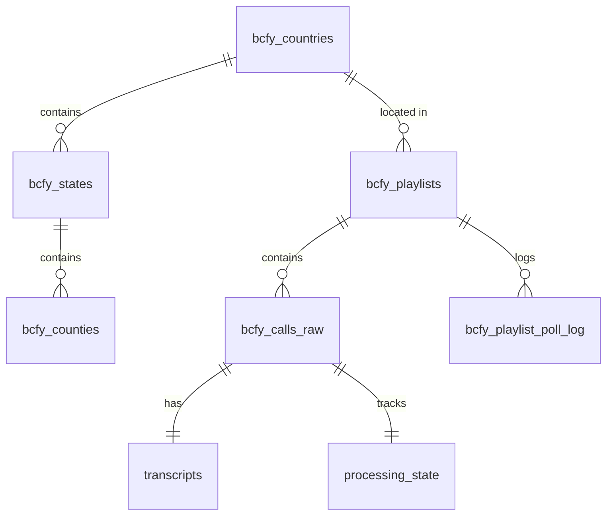

# Database Schema Documentation

This document describes the PostgreSQL database schema for the Police Scanner Analytics Platform.

## Entity Relationship Overview



## Core Tables

### Geographic Metadata

#### `bcfy_countries`
Master list of countries supported by Broadcastify.

| Column | Type | Description |
|--------|------|-------------|
| `coid` | INTEGER (PK) | Country ID |
| `name` | VARCHAR | Country name |
| `iso_code` | VARCHAR(2) | ISO 3166-1 alpha-2 code |

**Indexes:**
- Primary key on `coid`
- Index on `iso_code`

---

#### `bcfy_states`
US states and regions.

| Column | Type | Description |
|--------|------|-------------|
| `stid` | INTEGER (PK) | State ID |
| `coid` | INTEGER (FK) | Country ID |
| `name` | VARCHAR | State name |
| `abbr` | VARCHAR(2) | State abbreviation |

**Indexes:**
- Primary key on `stid`
- Foreign key to `bcfy_countries(coid)`
- Index on `abbr`

---

#### `bcfy_counties`
County/region data with geographic coordinates.

| Column | Type | Description |
|--------|------|-------------|
| `cntid` | INTEGER (PK) | County ID |
| `stid` | INTEGER (FK) | State ID |
| `name` | VARCHAR | County name |
| `lat` | DECIMAL(10,7) | Latitude |
| `lon` | DECIMAL(10,7) | Longitude |

**Indexes:**
- Primary key on `cntid`
- Foreign key to `bcfy_states(stid)`
- Spatial index on `(lat, lon)` for proximity queries

---

### Feed Management

#### `bcfy_playlists`
Active scanner feeds being monitored.

| Column | Type | Description |
|--------|------|-------------|
| `uuid` | VARCHAR (PK) | Unique feed identifier |
| `feed_name` | VARCHAR | Human-readable feed name |
| `listeners` | INTEGER | Current listener count |
| `groups_json` | JSONB | Feed metadata (groups, categories) |
| `coid` | INTEGER (FK) | Country ID |
| `created_at` | TIMESTAMP | Feed creation timestamp |
| `updated_at` | TIMESTAMP | Last update timestamp |

**Indexes:**
- Primary key on `uuid`
- Foreign key to `bcfy_countries(coid)`
- Index on `feed_name` for search
- GIN index on `groups_json` for JSON queries

---

#### `bcfy_playlist_poll_log`
Historical log of feed polling operations.

| Column | Type | Description |
|--------|------|-------------|
| `uuid` | VARCHAR (FK) | Feed UUID |
| `poll_started_at` | TIMESTAMP | Poll start time |
| `poll_duration_ms` | INTEGER | Poll duration in milliseconds |
| `calls_found` | INTEGER | Number of new calls discovered |
| `success` | BOOLEAN | Whether poll succeeded |

**Indexes:**
- Composite primary key on `(uuid, poll_started_at)`
- Index on `poll_started_at` for time-based queries

---

### Call & Transcription Data

#### `bcfy_calls_raw`
Call metadata from Broadcastify API.

| Column | Type | Description |
|--------|------|-------------|
| `call_uid` | VARCHAR (PK) | Unique call identifier |
| `started_at` | TIMESTAMP | Call start time |
| `url` | VARCHAR | MP3 download URL |
| `duration_sec` | INTEGER | Call duration in seconds |
| `playlist_uuid` | VARCHAR (FK) | Associated feed UUID |
| `processed` | BOOLEAN | Whether audio has been downloaded |
| `created_at` | TIMESTAMP | Record creation timestamp |

**Indexes:**
- Primary key on `call_uid`
- Foreign key to `bcfy_playlists(uuid)`
- **Composite index** on `(processed, started_at)` for efficient poll queries
- BTREE index on `started_at` for time-range queries

**Performance Notes:**
- The `(processed, started_at)` index is critical for the scheduler's query:
  ```sql
  SELECT * FROM bcfy_calls_raw
  WHERE processed = FALSE
  ORDER BY started_at DESC
  LIMIT 100
  ```

---

#### `transcripts`
Whisper transcription results with full-text search.

| Column | Type | Description |
|--------|------|-------------|
| `id` | SERIAL (PK) | Auto-increment transcript ID |
| `call_uid` | VARCHAR (FK, UNIQUE) | Call identifier |
| `text` | TEXT | Transcribed text |
| `tsvector` | TSVECTOR | Full-text search vector |
| `confidence` | DECIMAL(5,2) | Transcription confidence (0-100) |
| `language` | VARCHAR(5) | Detected language |
| `transcribed_at` | TIMESTAMP | Transcription completion time |

**Indexes:**
- Primary key on `id`
- Unique foreign key to `bcfy_calls_raw(call_uid)`
- **GIN index** on `tsvector` for full-text search
- Index on `transcribed_at`

**Full-Text Search:**
```sql
-- Example search query
SELECT * FROM transcripts
WHERE tsvector @@ plainto_tsquery('english', 'robbery chase');
```

---

### Processing Pipeline

#### `processing_state`
State machine tracking for audio processing pipeline.

| Column | Type | Description |
|--------|------|-------------|
| `call_uid` | VARCHAR (PK, FK) | Call identifier |
| `state` | VARCHAR(20) | Current state (queued/downloaded/transcribed/indexed) |
| `error_message` | TEXT | Error details if failed |
| `retry_count` | INTEGER | Number of retry attempts |
| `updated_at` | TIMESTAMP | Last state change time |

**States:**
1. `queued` - Audio download queued
2. `downloaded` - MP3 downloaded to MinIO
3. `transcribed` - Whisper transcription complete
4. `indexed` - Indexed in MeiliSearch
5. `failed` - Processing failed (check `error_message`)

**Indexes:**
- Primary key on `call_uid`
- Foreign key to `bcfy_calls_raw(call_uid)`
- Index on `state` for state-based queries
- Index on `updated_at`

---

### Monitoring

#### `system_logs`
Event logs for system monitoring and debugging.

| Column | Type | Description |
|--------|------|-------------|
| `id` | SERIAL (PK) | Log entry ID |
| `timestamp` | TIMESTAMP | Event timestamp |
| `component` | VARCHAR(50) | Service name (api/scheduler/transcribe) |
| `event_type` | VARCHAR(50) | Event category |
| `severity` | VARCHAR(10) | Severity level (INFO/WARNING/ERROR) |
| `message` | TEXT | Log message |
| `metadata_json` | JSONB | Additional structured data |

**Indexes:**
- Primary key on `id`
- Index on `timestamp` for time-based queries
- Index on `(component, severity)` for filtering
- GIN index on `metadata_json`

---

#### `api_call_metrics`
Performance tracking for API endpoints.

| Column | Type | Description |
|--------|------|-------------|
| `id` | SERIAL (PK) | Metric entry ID |
| `endpoint` | VARCHAR(100) | API endpoint path |
| `method` | VARCHAR(10) | HTTP method |
| `duration_ms` | INTEGER | Request duration |
| `status_code` | INTEGER | HTTP status code |
| `cache_hit` | BOOLEAN | Whether cache was hit |
| `timestamp` | TIMESTAMP | Request timestamp |

**Indexes:**
- Primary key on `id`
- Index on `(endpoint, timestamp)` for performance analysis
- Index on `status_code` for error tracking

---

## Database Migrations

### Migration Philosophy
- All schema changes through versioned migration files
- Migrations are sequential: `001_*.sql`, `002_*.sql`, etc.
- Each migration includes both UP and DOWN sections
- Test migrations on copy of production data before deploying

### Running Migrations
```bash
# Execute all pending migrations
python db/scripts/execute-migrations.py

# Or manually in PostgreSQL
psql -h $PGHOST -U $PGUSER -d $PGDATABASE -f db/migrations/001_phase1_improvements.sql
```

### Planned Optimizations

See `db/README_EXPERT_DBA_ANALYSIS.md` for detailed optimization plans including:
- **Phase 1**: Performance indexes and constraints
- **Phase 2**: Table partitioning by date (monthly)
- **Phase 3**: Enhanced state machine and data retention automation

---

## Performance Considerations

### Indexing Strategy
- **GIN indexes** for full-text search and JSONB queries
- **BTREE indexes** for time-range and equality queries
- **Composite indexes** for multi-column WHERE clauses
- **Partial indexes** for frequently filtered subsets

### Query Optimization Examples

**Efficient call retrieval:**
```sql
-- GOOD: Uses (processed, started_at) index
SELECT * FROM bcfy_calls_raw
WHERE processed = FALSE
ORDER BY started_at DESC
LIMIT 100;

-- BAD: Forces full table scan
SELECT * FROM bcfy_calls_raw
WHERE url LIKE '%mp3%'
ORDER BY started_at DESC;
```

**Efficient transcript search:**
```sql
-- GOOD: Uses GIN index on tsvector
SELECT * FROM transcripts
WHERE tsvector @@ plainto_tsquery('english', 'search terms');

-- BAD: Forces sequential scan
SELECT * FROM transcripts
WHERE text ILIKE '%search terms%';
```

---

## Backup & Maintenance

### Backup Strategy
```bash
# Create backup
make db-backup

# Restore from backup
psql -h $PGHOST -U $PGUSER -d $PGDATABASE < db/backups/backup_YYYYMMDD_HHMMSS.sql
```

### Vacuum & Analyze
PostgreSQL automatically runs autovacuum, but for large updates:
```sql
VACUUM ANALYZE bcfy_calls_raw;
VACUUM ANALYZE transcripts;
```

### Monitoring Queries
See `db/monitoring_queries.sql` for production monitoring queries including:
- Table sizes
- Index usage statistics
- Slow query analysis
- Lock monitoring

---

## References

- **Schema Files**: `db/init.sql`
- **Migrations**: `db/migrations/`
- **DBA Analysis**: `db/README_EXPERT_DBA_ANALYSIS.md`
- **Migration Runner**: `db/scripts/execute-migrations.py`
